# [RFC] Request for Comments — SIGOF

**Sistema Inteligente de Gestão de Ocorrências de Frete**

**Projeto de Portfólio**

---

# Identificação

- **Título do Projeto:**  
  SIGOF — Sistema Inteligente de Gestão de Ocorrências de Frete

- **Linha de Projeto (Direction):**  
  Web Apps

- **Autor:**  
  Wellerson Meredyk

- **Data da Proposta:**  
  12/04/2026

- **Versão:**  
  2.1

- **Histórico de Versões:**  
  - v1.0 (12/04/2026): Versão inicial com portal externo para clientes  
  - v2.0 (11/06/2026): Escopo revisado — sistema exclusivamente interno; clientes externos removidos do fluxo de abertura de tickets  
  - v2.1 (14/06/2026): Posicionamento de produto definido — MVP interno validado na Aceville, com arquitetura preparada para evolução SaaS multi-transportadora; escopo funcional focado em correções fiscais/documentais de CTe

---

# Resumo (Abstract)

Transportadoras lidam diariamente com a necessidade de correções em documentos de transporte eletrônico (CTe) — reversões de frete, troca de pagador e ajustes fiscais. Na **Aceville Transportes**, essas solicitações circulam internamente de forma desorganizada, principalmente por e-mail, sem padrão, sem priorização e sem rastreabilidade, resultando em retrabalho, atrasos (2 a 5 dias por ocorrência) e perda de controle financeiro.

O **SIGOF** propõe um sistema web de gestão de ocorrências de frete que substitui o fluxo caótico de e-mails por um sistema de tickets estruturado: protocolo único, fila priorizada, atribuição de responsável, comunicação registrada e histórico auditável. O **objetivo** é aumentar a eficiência operacional em pelo menos 30%, reduzir duplicidades e dar rastreabilidade total às solicitações.

O **MVP** é validado internamente na Aceville (parceira de extensão), e a arquitetura é projetada como multi-tenant, permitindo a evolução para um produto SaaS voltado a transportadoras pequenas e médias. A solução será construída como uma aplicação web (React/Next.js, Node.js, PostgreSQL).

**Palavras-chave:** gestão de ocorrências, logística, CTe, sistema de tickets, transportadoras, SaaS.

---

# 1. Visão do Produto e Impacto (O Problema)

O objetivo desta seção é responder uma pergunta fundamental:

**Este projeto resolve um problema real ou é apenas um exercício técnico?**

A resposta é clara: **o SIGOF resolve um problema concreto em transportadoras de todo o Brasil.**

---

## 1.1 Contexto e Problema

O setor logístico de transportadoras lida frequentemente com a necessidade de correções em documentos de transporte eletrônico (CTe), como reversões de frete, troca de pagador, ajustes fiscais e inconsistências operacionais.

Essas demandas surgem em diferentes frentes internas: o setor financeiro identifica divergências ao cobrar faturas vencidas (ex: o cliente contesta que o pagador registrado no CTe está errado), enquanto vendedores que lidam diretamente com clientes recebem reclamações e precisam acionar a equipe de reversões.

Atualmente, a comunicação interna dessas solicitações é feita de forma **caótica e sem padrão**, principalmente por e-mail, com os seguintes problemas recorrentes:

- solicitações enviadas com mensagem vaga ("favor reverter") sem número de CTe, NF ou contexto mínimo
- analista precisa caçar o erro manualmente nos históricos de e-mail
- quando alguém cobra retorno, o e-mail sobe novamente na caixa de entrada, empurrando casos urgentes para o fundo da fila
- sem ordem de prioridade definida — quem insiste mais é atendido primeiro
- dependência de pessoas específicas (ex: quando um colaborador está de férias)
- ausência de histórico estruturado
- uso de controles manuais (anotações em papel)

O processo atual também dificulta o controle de erros operacionais, como:

- erros de digitação
- erros de emissão de CTe
- erros de pagador (ex: empresa X registrada, mas deveria ser Y)
- inconsistências fiscais

**Impacto direto para o negócio:**

- aumento do tempo de resolução (média de 2-5 dias por solicitação)
- redução da eficiência operacional da equipe de reversões
- perda de controle financeiro (ex: comissões e encargos inadequados)
- retrabalho excessivo na busca de informações incompletas

---

## 1.2 Origem da Demanda e Evidências

Existe **interesse real** pela solução, demonstrado através da vivência prática no setor.

### Demanda Observada

O projeto é baseado em uma demanda real observada na empresa **Aceville Transportes**, onde o autor atua diretamente no processo de reversão de fretes.

**Contexto da empresa:**

- Múltiplas filiais e agências espalhadas geograficamente
- Processo de reversão realizado por equipe reduzida (2-3 pessoas)
- Alto volume de solicitações diárias (aproximadamente 20-30 por dia)
- Clientes diversos com demandas específicas

**Problema relatado:**

- desorganização contínua no fluxo de solicitações
- dificuldade de controle e acompanhamento em tempo real
- retrabalho e perda significativa de eficiência
- demora média de 2-7 dias para resolver uma ocorrência

### Observação de Processo Real

O problema foi identificado através da vivência prática no setor, onde foi possível observar:

- solicitações duplicadas para o mesmo CTe (ocorrem 3-4 vezes por semana)
- necessidade constante de comunicação manual entre colaboradores
- dependência de anotações físicas para manter controle
- ausência total de indicadores de desempenho
- frustração dos clientes pela falta de atualizações

### Evidência de Interesse Confirmada

A necessidade da solução é evidenciada por:

- **Volume diário:** 20-30 solicitações por dia na empresa observada
- **Dificuldades recorrentes:** mencionadas em 100% das conversas com a equipe
- **Impacto mensurável:** perda estimada de 5-10 horas/semana com retrabalho
- **Demanda de clientes:** múltiplos relatos de insatisfação pelo tempo de resolução

---

## 1.3 Análise de Soluções Existentes (Benchmark)

Foram analisadas **4 soluções** que tentam resolver problemas similares:

### Soluções Analisadas

**1. Jira Service Management**
- Link: https://www.atlassian.com/software/jira/service-management
- Público-alvo: Equipes de TI e suporte técnico
- Funcionalidades: gestão de tickets, workflows customizáveis, relatórios e automações
- Limitação: não atende regras específicas de logística e CTe; muito genérico; custo elevado

**2. Freshdesk**
- Link: https://www.freshworks.com/freshdesk/
- Público-alvo: Atendimento ao cliente
- Funcionalidades: centralização de chamados, integração multi-canal, base de conhecimento
- Limitação: não atende regras fiscais; sem lógica de negócio para frete

**3. Zendesk**
- Link: https://www.zendesk.com/
- Público-alvo: Suporte ao cliente
- Funcionalidades: gestão de tickets, automações, relatórios avançados
- Limitação: não contempla fluxo logístico; genérico demais

**4. Soluções Ad-Hoc**
- Planilhas Excel, Google Forms + Google Sheets
- Público-alvo: Empresas pequenas
- Funcionalidades: registro básico, acesso compartilhado
- Limitação: sem segurança adequada; sem escalabilidade

### Comparação

| Solução | Pontos Fortes | Limitações |
|---------|---------------|-----------|
| Jira | Customização; Escalabilidade | Genérico; Complexo |
| Freshdesk | Interface amigável; Integrado | Sem lógica de frete |
| Zendesk | Relatórios avançados; Escalável | Muito genérico | 
| Planilhas | Livre; Fácil | Sem segurança; Pouco profissional | 

### Diferencial do Projeto SIGOF

O SIGOF se diferencia por ser **focado especificamente em logística e transportadoras**, oferecendo:

- ser focado em ocorrências de frete e CTe
- contemplar regras específicas de regulamentação fiscal e logística
- permitir controle granular de erros operacionais com categorização
- integrar as diferentes frentes **internas** (financeiro, comercial e operacional) em um único fluxo padronizado
- gerar indicadores logísticos em tempo real
- ser construído especificamente para o setor
- solução de **menor custo** para transportadoras pequenas e médias

---

### Trabalhos Relacionados (Estado da Arte)

Além das soluções comerciais analisadas no benchmark, o SIGOF se apoia em três áreas de conhecimento já consolidadas, que fundamentam suas decisões:

- **Sistemas de gestão de chamados (help desk / service desk):** estruturação de demandas em tickets, filas, SLA e histórico — princípios que o SIGOF aplica ao domínio logístico.
- **Gestão de serviços de TI (ITIL/ITSM):** conceitos de gestão de incidentes, priorização e ciclo de vida de uma solicitação.
- **Transformação digital em processos logísticos:** estudos sobre digitalização de processos manuais em transportadoras e seus ganhos de eficiência e rastreabilidade.

> **A completar (NP2):** inclua aqui 2 a 3 referências acadêmicas reais (artigos, monografias ou livros) sobre esses temas. Busque no **Google Scholar** / periódicos por termos como *"sistema de gestão de chamados"*, *"help desk ITIL"*, *"digitalização de processos logísticos"*. Para cada trabalho, descreva em 2–3 linhas o que ele aborda e como se relaciona com o SIGOF, e adicione a citação completa na seção 8 (Referências).

---

## 1.4 Público-Alvo

No **MVP**, o sistema é voltado exclusivamente para **usuários internos da Aceville Transportes** — a transportadora parceira onde a solução será validada. Clientes externos não interagem com o sistema. A arquitetura, porém, é desenhada para que cada transportadora seja um espaço isolado, permitindo a evolução para um produto SaaS multi-transportadora (ver seção 1.7).

**Perfis de usuário:**

- **Solicitante (Financeiro / Comercial)** — abre tickets ao identificar divergências de pagador durante cobranças ou ao receber reclamações de clientes
- **Analista de Reversões** — recebe, processa e resolve os tickets abertos
- **Supervisor** — acompanha métricas, prioriza e monitora desempenho da equipe
- **Administrador** — gerencia usuários, perfis e parâmetros da empresa (no modelo SaaS, administra o espaço da sua transportadora)

**Perfil geral:**

- conhecimento básico a intermediário de informática
- uso em ambiente corporativo durante horário comercial
- necessidade de rapidez na resposta e clareza nas informações
- acesso exclusivamente por navegador web (sem instalação de software)

---

## 1.5 Objetivos do Projeto

### Objetivo Geral

Desenvolver um **sistema web para centralizar, organizar e gerenciar solicitações de ocorrências de frete**, aumentando a eficiência operacional em pelo menos 30%, reduzindo erros e aumentando a rastreabilidade dos processos logísticos.

### Objetivos Específicos

1. **Centralizar** todas as solicitações em um único sistema, eliminando fragmentação
2. **Criar controle estruturado** por protocolo único para cada solicitação
3. **Permitir atribuição clara** de responsáveis e evitar falta de ownership
4. **Implementar priorização** de demandas baseada em critérios definidos
5. **Registrar histórico completo** e auditável de todas as operações
6. **Reduzir duplicidade** de solicitações e retrabalho
7. **Reduzir erros operacionais** através de validações e regras de negócio
8. **Gerar indicadores e relatórios** para análise de desempenho

---

## 1.6 Métricas de Sucesso (KPIs)

- **Tempo de resolução:** redução de 40% (de 3 dias para 1.8 dias em média)
- **Duplicidade de solicitações:** redução de 95%
- **Rastreabilidade:** 100% das solicitações registradas e rastreáveis
- **Erros operacionais:** redução de 50% através de validações
- **Aceitação de usuários:** 90% da equipe usando o sistema regularmente
- **Disponibilidade:** sistema online 99% do tempo
- **Satisfação interna:** aumento de 40% na satisfação das áreas solicitantes (financeiro e comercial) com o tempo de resposta

> **Nota metodológica:** os percentuais e prazos acima são **metas estimadas**, derivadas da observação informal do processo atual na Aceville. Os valores de linha de base (baseline) serão **medidos formalmente** antes do desenvolvimento e **validados** após a implantação do MVP, com a equipe. As estimativas poderão ser ajustadas conforme essa medição.

---

## 1.7 Visão de Produto e Evolução (SaaS)

O SIGOF nasce resolvendo uma dor concreta e validável na **Aceville Transportes**, que atua como parceira de extensão deste projeto. Esse é o **escopo do MVP** e o foco da validação acadêmica.

Entretanto, o problema atacado — comunicação caótica de correções de CTe — **não é exclusivo da Aceville**; ele se repete em transportadoras pequenas e médias de todo o Brasil (conforme o benchmark da seção 1.3). Por isso, o SIGOF é projetado com uma **visão de produto SaaS multi-transportadora**:

- **MVP (escopo deste TCC):** operação para uma única transportadora (Aceville), com validação real junto à equipe.
- **Evolução (pós-MVP):** cada transportadora passa a ser um *tenant* isolado, com seus próprios usuários, solicitações e dados, sem que uma empresa enxergue os dados da outra.

Para não comprometer essa evolução, duas decisões já são incorporadas desde o MVP:

1. **Isolamento por empresa no modelo de dados** — toda solicitação, usuário e anexo é vinculado a uma `Empresa` (tenant). No MVP existe apenas a Aceville, mas a chave de separação já existe (ver seções 5.2 e 5.5).
2. **Autenticação e autorização por empresa** — o login identifica a empresa do usuário e restringe o acesso aos dados daquela empresa.

> O detalhamento técnico do isolamento multi-tenant está na seção **5.5 (Estratégia de Multi-tenancy)**. Recursos comerciais de SaaS (planos, cobrança, onboarding self-service, SLA contratual por plano) estão **fora do escopo do MVP** (ver seção 2.6).

---

# 2. Engenharia de Requisitos

---

## 2.1 Personas

### Persona 1 — Analista de Logística (João Silva)

- **Contexto:** Trabalha na transportadora realizando correções de CTe. 28 anos, 5 anos de experiência.
- **Objetivo:** Resolver solicitações rapidamente e sem erros, com acompanhamento claro de seu desempenho
- **Habilidades:** Conhecimento intermediário de sistemas; profundo conhecimento em CTe
- **Principais dificuldades:**
  - demandas chegam desorganizadas de múltiplas fontes
  - falta de prioridade clara (o que resolver primeiro?)
  - retrabalho quando há solicitações duplicadas
  - falta de métricas pessoais de productividade

### Persona 2 — Analista Financeiro (Ana Lima)

- **Contexto:** Trabalha no setor financeiro da Aceville, responsável por cobranças de faturas. 32 anos, 4 anos na empresa.
- **Objetivo:** Registrar rapidamente a divergência identificada durante uma cobrança e acompanhar a resolução sem perder o fio da meada
- **Habilidades:** Conhecimento intermediário de sistemas; domínio de planilhas e rotinas financeiras
- **Principais dificuldades:**
  - precisa enviar email com muitos detalhes que muitas vezes não tem em mãos
  - não sabe se a solicitação foi recebida ou está sendo tratada
  - perde tempo tentando localizar o status de solicitações antigas no histórico de emails

### Persona 3 — Gestor/Supervisor (Carlos Souza)

- **Contexto:** Supervisor da área de reversões; responsável por métricas
- **Objetivo:** Garantir que processos sejam seguidos corretamente
- **Habilidades:** Conhecimento avançado de sistemas
- **Principais dificuldades:**
  - falta de visibilidade do que está sendo feito
  - dificuldade de gerar relatórios de desempenho
  - impossibilidade de identificar gargalos

### Persona 4 — Vendedor/Comercial (Marina Rocha)

- **Contexto:** Vendedora da Aceville, atende clientes diretamente. 35 anos, 6 anos na empresa.
- **Objetivo:** Registrar rapidamente a reclamação de um cliente sobre um frete e poder dar um retorno confiável de prazo, sem depender de "puxar" o assunto por e-mail
- **Habilidades:** Conhecimento básico de sistemas; foco em relacionamento e vendas
- **Principais dificuldades:**
  - não sabe a quem encaminhar cada tipo de problema
  - fica sem resposta para repassar ao cliente
  - perde credibilidade quando o prazo prometido não é cumprido

### Persona 5 — Administrador (Rafael Dias)

- **Contexto:** Responsável de TI/processos da Aceville que mantém o sistema. 30 anos.
- **Objetivo:** Cadastrar e gerenciar usuários, perfis e parâmetros da empresa, garantindo que cada pessoa tenha o acesso correto
- **Habilidades:** Conhecimento avançado de sistemas e administração de acessos
- **Principais dificuldades:**
  - controlar quem pode fazer o quê (perfis e permissões)
  - garantir que dados sensíveis fiquem restritos
  - no futuro (modelo SaaS), administrar o espaço isolado da sua transportadora

---

## 2.2 Casos de Uso Principais

- Criar solicitação de ocorrência de novo CTe
- Anexar documentos comprobatórios
- Consultar status da solicitação em tempo real
- Atribuir solicitação a responsável
- Atualizar status do atendimento
- Trocar mensagens com o solicitante interno
- Visualizar histórico completo da solicitação
- Finalizar solicitação com resultado
- Gerar relatórios de desempenho
- Identificar solicitações duplicadas
- Priorizar solicitações por urgência

### Diagrama de Casos de Uso (UML)

O diagrama UML de casos de uso — com os **atores representados pelo "bonequinho"** (stick figure) padrão, elipses de casos de uso, fronteira do sistema e relacionamentos `<<include>>`/`<<extend>>` — está versionado como código-fonte em [`diagrams/casos-de-uso.puml`](diagrams/casos-de-uso.puml).

Para gerar a imagem: cole o conteúdo do arquivo em [plantuml.com/plantuml](https://www.plantuml.com/plantuml) (ou use a extensão PlantUML no VS Code) e exporte como PNG para `docs/assets/casos-de-uso.png`. Em seguida, insira a imagem aqui:

```markdown

```

> A prévia abaixo (Mermaid) renderiza diretamente no GitHub para conferência rápida dos atores e casos, mas **não substitui** a versão UML com bonequinho exigida pela banca — esta deve ser a imagem gerada a partir do arquivo `.puml`.

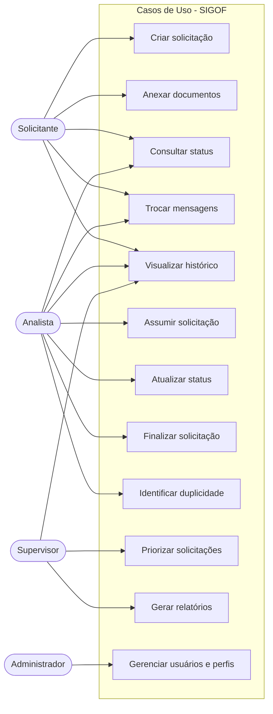

---

## 2.3 Requisitos Funcionais (RF)

| ID | Descrição |
|----|-----------|
| RF01 | O sistema deve permitir que funcionários internos autenticados criem uma solicitação de ocorrência de frete. |
| RF02 | O sistema deve permitir anexar até 10 arquivos por solicitação (limite de 5MB cada). |
| RF03 | O sistema deve gerar automaticamente um número de protocolo único para cada solicitação. |
| RF04 | O sistema deve permitir que usuários internos visualizem todas as solicitações com filtros. |
| RF05 | O sistema deve permitir que um usuário interno assuma uma solicitação. |
| RF06 | O sistema deve permitir atualizar o status da solicitação. |
| RF07 | O sistema deve permitir comunicação em tempo real entre o analista e o solicitante interno. |
| RF08 | O sistema deve permitir que supervisores priorizem solicitações. |
| RF09 | O sistema deve alertar quando há duplicidade de solicitação para o mesmo CTe/NF. |
| RF10 | O sistema deve permitir visualizar histórico completo com timestamp. |
| RF11 | O sistema deve gerar relatórios customizáveis. |
| RF12 | O sistema deve suportar diferentes perfis de usuário. |

---

## 2.4 Requisitos Não Funcionais (RNF)

| ID | Descrição |
|----|-----------|
| RNF01 | O sistema deve suportar no mínimo 50 usuários simultâneos. |
| RNF02 | O tempo de resposta deve ser inferior a 2 segundos para 95% das requisições. |
| RNF03 | O sistema deve possuir autenticação segura (JWT ou OAuth 2.0). |
| RNF04 | O sistema deve manter disponibilidade mínima de 99% durante horário comercial. |
| RNF05 | O sistema deve ser acessível via navegador web moderno. |
| RNF06 | Dados sensíveis devem ser criptografados em repouso. |
| RNF07 | O sistema deve fazer backup automático dos dados diariamente. |
| RNF08 | O sistema deve ser responsivo e acessível via dispositivos móveis. |
| RNF09 | Logs de todas as operações devem ser mantidos por no mínimo 12 meses. |
| RNF10 | O código deve seguir boas práticas de segurança (OWASP Top 10). |

---

## 2.5 Regras de Negócio

- Cada solicitação deve possuir um protocolo único e imutável
- Apenas usuários internos podem assumir solicitações
- Solicitações não podem ser excluídas, apenas finalizadas ou canceladas
- Uma solicitação pode conter múltiplos CTe relacionados
- O sistema deve alertar quando há duplicidade (mesmo CTe/NF em 7 dias)
- Apenas supervisores podem alterar prioridade
- Prazo máximo para atendimento inicial: 4 horas (horário comercial)
- O solicitante recebe notificação a cada mudança de status

---

## 2.6 Fora do Escopo

- Portal de acesso para clientes externos (clientes da Aceville não interagem diretamente com o sistema)
- Recursos comerciais de SaaS no MVP: planos/assinaturas, cobrança automática, onboarding self-service de novas transportadoras e SLA contratual por plano (o MVP opera apenas para a Aceville; o isolamento multi-tenant é preparado, mas a comercialização não faz parte deste escopo)
- Integração com sistemas fiscais (SEFAZ)
- Automação completa de cálculos de comissão
- Integração com WhatsApp para notificações
- Emissão automática de CTe corrigido
- Integração com sistemas ERP legados

---

# 3. Fluxos e Comportamento do Sistema

---

## 3.1 Fluxo Principal do Usuário (Happy Path)

1. **Funcionário interno acessa o sistema** (financeiro, vendedor ou operacional)
2. **Clica em "Nova Solicitação"**
3. **Preenche formulário** com tipo de ocorrência, CTe/NF, pagador correto, descrição detalhada e anexos
4. **Sistema gera protocolo automaticamente**
5. **Solicitação entra na fila** de analistas de reversão (status: "Novo")
6. **Analista visualiza** no dashboard e assume
7. **Analista analisa** e adiciona comentários internos se necessário
8. **Analista marca como "Resolvido"** com descrição da ação tomada
9. **Solicitante recebe notificação interna** de resolução
10. **Solicitação é finalizada** com registro da ação
11. **Histórico completo fica registrado** para auditoria

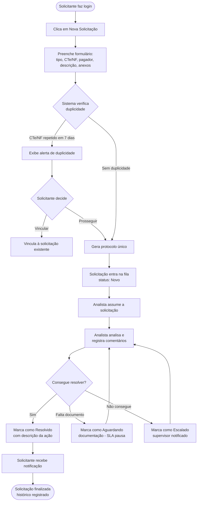

---

## 3.2 Fluxos Alternativos

### Cenário: Solicitação Duplicada
- **Trigger:** mesmo CTe/NF em 7 dias
- **Ação:** sistema exibe alerta
- **Resultado:** usuário escolhe vincular ou prosseguir

### Cenário: Falta de Documentação
- **Trigger:** solicitação sem anexos suficientes
- **Ação:** analista marca como "Aguardando documentação"
- **Resultado:** solicitante é alertado; SLA pausado

### Cenário: Erro no Processamento
- **Trigger:** problema não pode ser resolvido
- **Ação:** analista marca como "Escalado"
- **Resultado:** supervisor é notificado

---

## 3.3 Três Fluxos de Negócio Completos (Linha Web Apps)

A linha **Web Apps** exige a demonstração de **três fluxos de negócio completos** (ponta a ponta). Eles estão descritos a seguir, cada um envolvendo atores, regras de negócio e estados distintos do sistema.

### Fluxo 1 — Abertura e resolução de correção de CTe (reversão de frete)

| Etapa | Ator | Ação | Regra de negócio aplicada |
|-------|------|------|----------------------------|
| 1 | Solicitante | Cria solicitação (tipo "reversão"), informa CTe/NF e anexa comprovantes | RF01, RF02; protocolo único (RF03) |
| 2 | Sistema | Gera protocolo `SOL-AAAA-MM-NNNN` e coloca na fila (status "Novo") | Protocolo imutável; SLA inicial de 4h |
| 3 | Analista | Assume a solicitação e analisa | RF05; apenas usuários internos assumem |
| 4 | Analista | Marca como "Resolvido" com descrição da ação | RF06; solicitação não pode ser excluída |
| 5 | Sistema | Notifica o solicitante e registra no histórico auditável | RF07, RF10; notificação a cada mudança de status |

**Resultado:** ocorrência resolvida, rastreável e auditável de ponta a ponta.

### Fluxo 2 — Troca de pagador com pendência de documentação

| Etapa | Ator | Ação | Regra de negócio aplicada |
|-------|------|------|----------------------------|
| 1 | Solicitante | Cria solicitação (tipo "troca de pagador") informando pagador correto | RF01 |
| 2 | Sistema | Detecta possível duplicidade do CTe/NF em 7 dias e alerta | RF09; mesmo CTe/NF em 7 dias |
| 3 | Solicitante | Decide prosseguir (não é duplicidade) | Vincular ou prosseguir |
| 4 | Analista | Assume e identifica falta de documento → status "Aguardando documentação" | SLA é pausado |
| 5 | Solicitante | Anexa o documento faltante; SLA é retomado | RF02 |
| 6 | Analista | Conclui a troca de pagador e finaliza | RF06, RF08 |

**Resultado:** demonstra os estados de exceção (duplicidade e pausa de SLA) e o retorno ao fluxo normal.

### Fluxo 3 — Escalonamento e acompanhamento gerencial

| Etapa | Ator | Ação | Regra de negócio aplicada |
|-------|------|------|----------------------------|
| 1 | Analista | Não consegue resolver e marca como "Escalado" | Supervisor é notificado |
| 2 | Supervisor | Recebe a notificação e ajusta a prioridade para "Urgente" | RF08; apenas supervisores alteram prioridade |
| 3 | Supervisor | Reatribui a um analista sênior | RF05 |
| 4 | Analista sênior | Resolve e finaliza | RF06 |
| 5 | Supervisor | Consulta o dashboard gerencial e gera relatório de desempenho | RF11; KPIs (seção 1.6) |

**Resultado:** cobre o ciclo de gestão (priorização, reatribuição e análise de indicadores).

---

# 4. Mockups e Experiência do Usuário (UX)

---

## 4.1 Fluxo de Navegação

**Solicitante Interno (Financeiro / Vendedor):**
```
Login → Dashboard → Nova Solicitação → Minhas Solicitações → Detalhes → Acompanhar
```

**Analista de Reversões:**
```
Login → Dashboard Principal → Fila de Solicitações → Detalhes → Assumir → Comentários → Finalizar
```

**Supervisor:**
```
Login → Dashboard Gerencial → Relatórios → Solicitações → Métricas
```

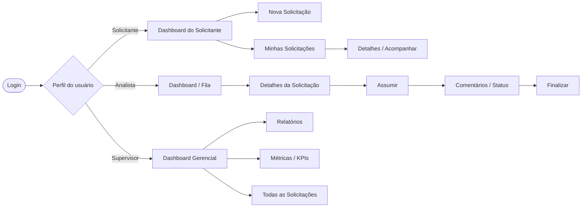

---

## 4.2 Wireframes das Principais Telas

Os mockups a seguir foram gerados no Google Stitch e representam a proposta visual do sistema.

> **Nota sobre os dados de exemplo:** os tipos de ocorrência exibidos nas linhas de exemplo de alguns mockups (ex.: "avaria", "extravio") são ilustrativos. O **escopo funcional oficial do MVP** são as correções fiscais/documentais de CTe: **reversão de frete, troca de pagador e ajuste fiscal** (ver seções 2.5 e 5.2). As telas serão regeradas com esses tipos na versão final.

### Tela 1: Login

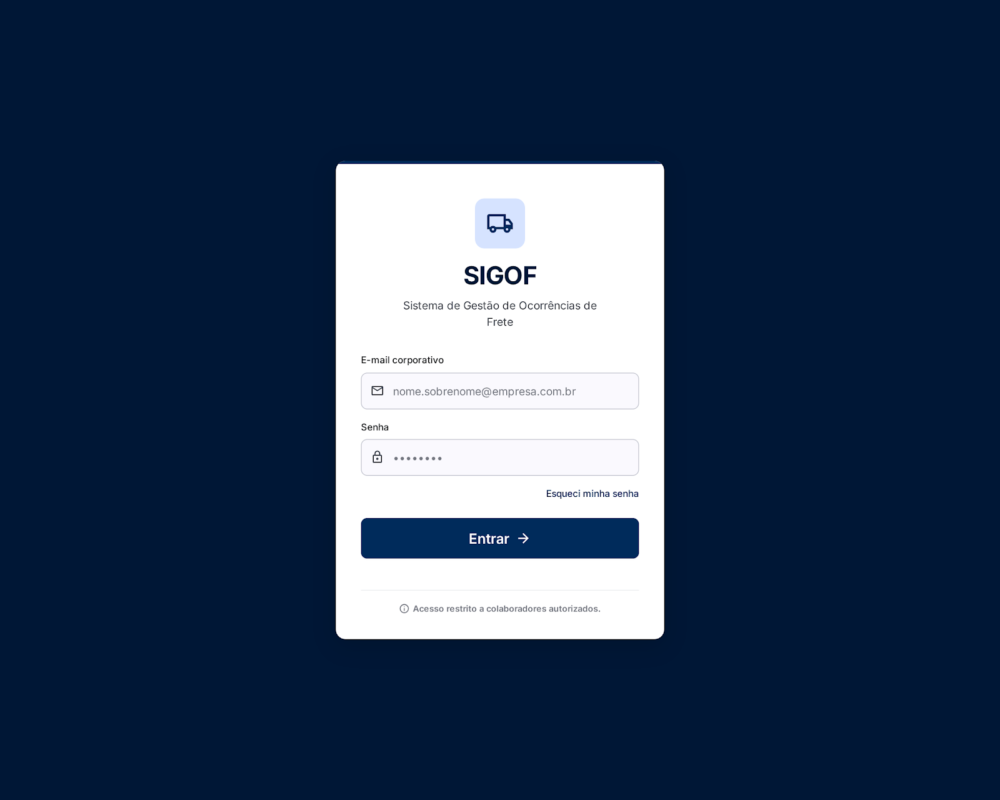

- Campo de e-mail corporativo/login
- Campo de senha
- Opção de redefinir senha
- (Cadastro de novos usuários é feito apenas pelo administrador interno)

### Tela 2: Dashboard do Solicitante (Financeiro / Comercial)

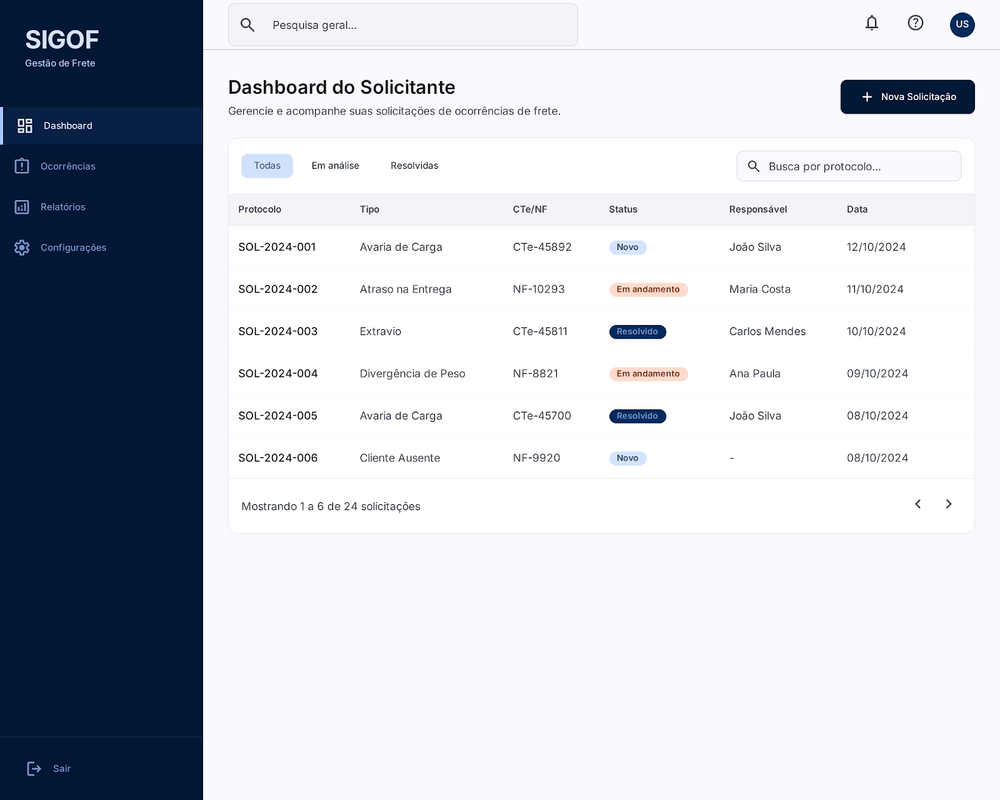

- Histórico das minhas solicitações (tabela com protocolo, status, data)
- Botão "Nova Solicitação" destacado
- Filtros rápidos (todos, em análise, resolvidos)
- Busca por protocolo

### Tela 3: Criar Solicitação

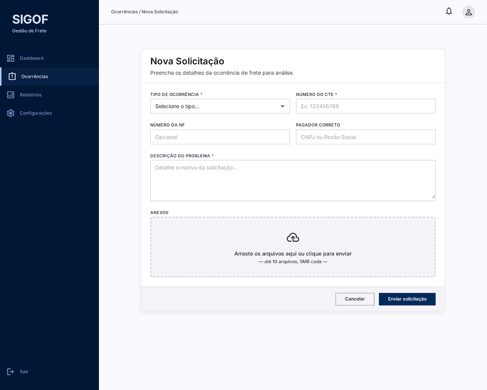

- Tipo de ocorrência (dropdown)
- Número da CTe/NF
- Descrição do problema (textarea)
- Upload de anexos (drag and drop)
- Botões: Cancelar | Enviar

### Tela 4: Dashboard Analista

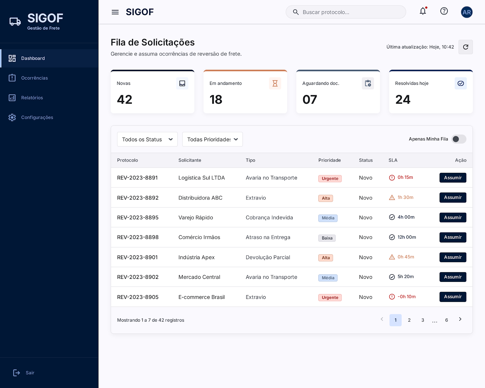

- Fila de solicitações (protocolo, solicitante, status, prioridade, data)
- Filtros (status, prioridade, minha fila)
- Botão de assumir solicitação
- Indicador visual de SLA

### Tela 5: Detalhes da Solicitação

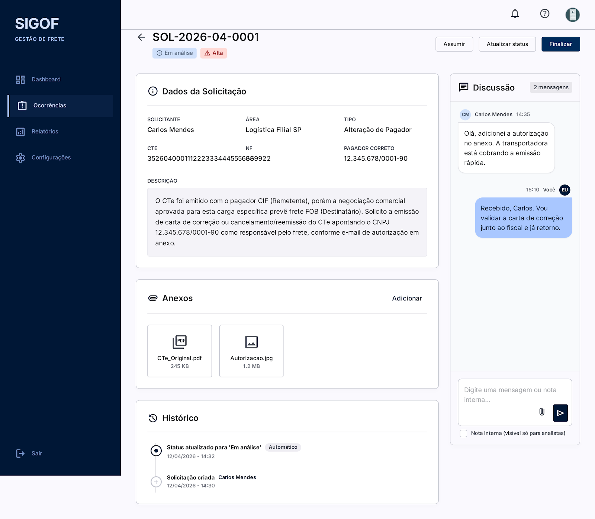

- Informações do solicitante interno (área e responsável)
- Detalhes do CTe/NF
- Histórico de ações (timeline)
- Chat com o solicitante interno
- Botões de ação (assumir, atualizar status, finalizar)
- Anexos (visualização em miniatura)

### Tela 6: Dashboard Gerencial

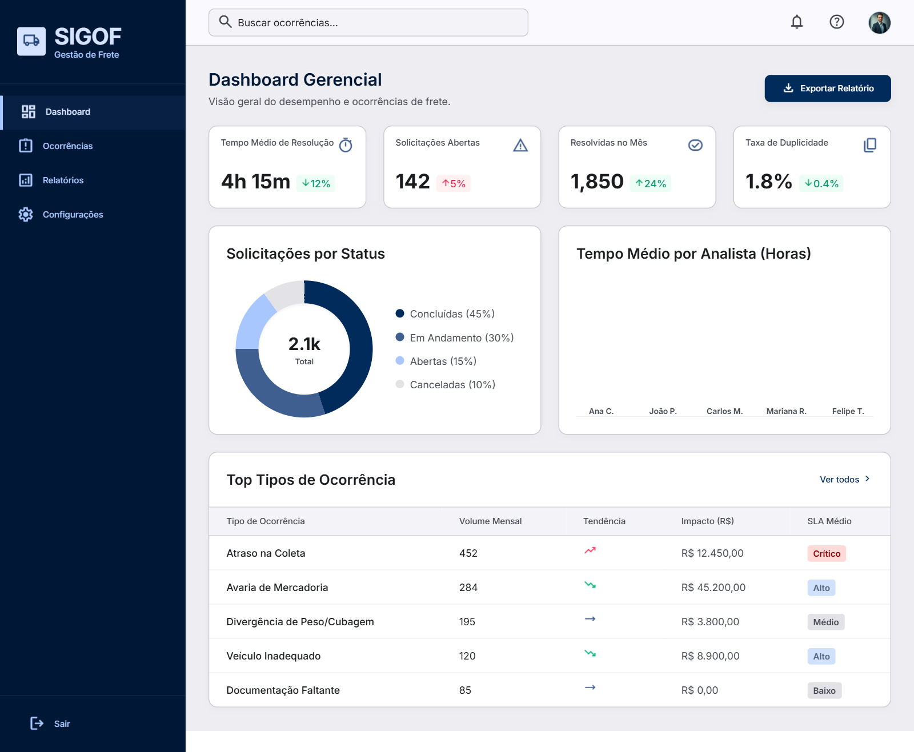

- KPIs principais em cards
- Gráfico de solicitações por status
- Gráfico de tempo médio por analista
- Tabela de top erros
- Acesso a relatórios

---

## 4.3 Fluxo de Interação do Usuário (Passo a Passo)

### Fluxo: Funcionário interno abre solicitação de correção de frete

1. **Funcionário acessa o sistema** (ex: Ana do financeiro, após cliente contestar cobrança)
2. **Faz login** com suas credenciais internas
3. **Vê dashboard** mostrando suas solicitações abertas
4. **Clica em "Nova Solicitação"**
5. **Seleciona tipo**: "Reversão de frete"
6. **Insere número da CTe e da NF**
7. **Informa o pagador correto** (ex: de "Empresa X" para "Empresa Y")
8. **Descreve o problema** com contexto completo
9. **Anexa comprovantes** (arquivo PDF, e-mail do cliente, etc.)
10. **Clica em "Enviar"**
11. **Sistema exibe**: "Protocolo: **SOL-2026-04-0001**"
12. **(Depois) Funcionário vê**: "Assumida por João Silva"
13. **(Depois) Funcionário vê**: "Em análise"
14. **(Depois) Funcionário vê**: "Resolvida — reversão processada"

---

## 4.4 Feedback Inicial de Usuários

A ser coletado com a equipe da Aceville Transportes durante desenvolvimento.

---

# 5. Arquitetura do Sistema

---

## 5.1 Diagrama C4

A arquitetura é documentada seguindo o **C4 model** de Simon Brown ([c4model.com](https://c4model.com/)), nos três primeiros níveis de abstração (Contexto, Containers e Componentes). Os diagramas usam a **notação padrão do C4**: cada elemento traz seu **tipo** (Pessoa, Sistema de Software, Container ou Componente), uma **descrição curta** e, para containers/componentes, a **tecnologia**; as **relações são direcionais e rotuladas** com a intenção e o protocolo.

**Legenda (key) — convenção de cores e formas do C4:**

| Notação | Significado |
|---------|-------------|
| 🟦 Azul-escuro, figura de pessoa | **Pessoa / ator** (usuário do sistema) |
| 🟦 Azul, caixa | **Sistema de software em escopo** (SIGOF) |
| ⬜ Cinza, caixa | **Sistema externo** (fora do escopo, integrado) |
| 🟦 Azul-médio, caixa | **Container** (aplicação ou serviço executável) |
| 🟦 Azul-médio, cilindro | **Container de dados** (banco de dados / cache) |
| 🟦 Azul-claro, caixa | **Componente** (módulo interno de um container) |
| ⤍ Linha tracejada rotulada | **Relação** (intenção + tecnologia/protocolo) |

> Os diagramas abaixo usam a sintaxe nativa **C4** do Mermaid (`C4Context`/`C4Container`/`C4Component`), que renderiza automaticamente as formas e cores padrão do C4 (figura de pessoa, cilindro de banco, sistemas externos em cinza e fronteira do sistema).

### Nível 1: Diagrama de Contexto

Mostra o SIGOF como uma caixa central, cercado pelos seus usuários (todos internos à Aceville) e pelos sistemas externos com que se integra. Detalhe técnico não é o foco aqui — é a visão "de longe" do sistema.

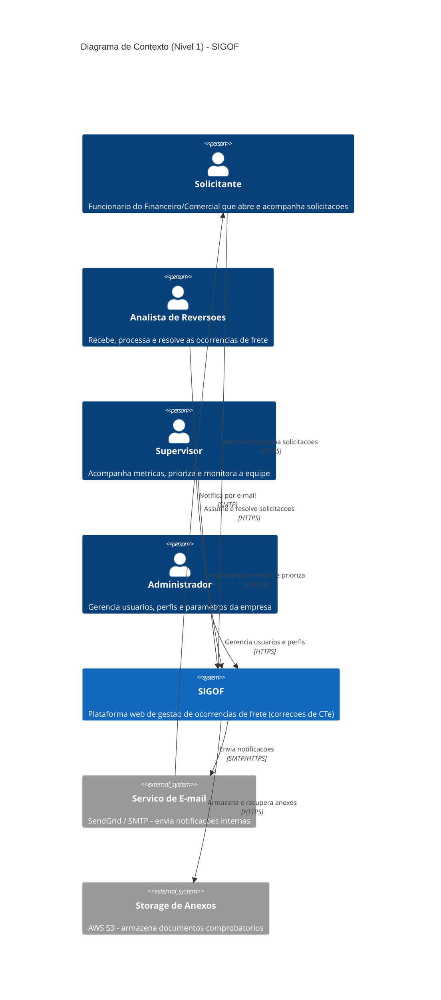

### Nível 2: Diagrama de Containers

Amplia o SIGOF e mostra como as responsabilidades estão distribuídas entre os containers (aplicações e armazéns de dados) e as principais escolhas de tecnologia.

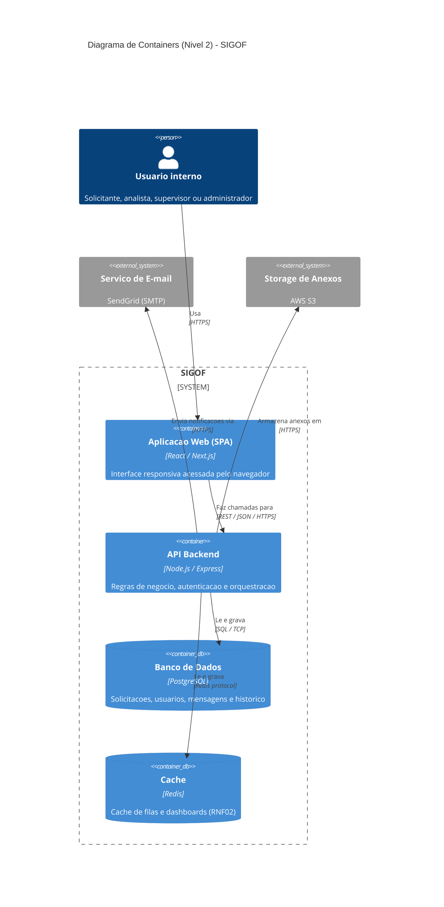

### Nível 3: Diagrama de Componentes (API Backend)

Amplia o container **API Backend** e mostra seus principais componentes internos e responsabilidades.

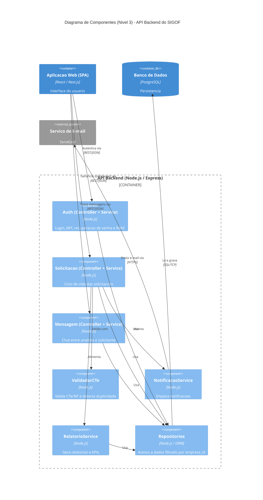

---

## 5.2 Modelo de Dados

**Principais Entidades:**

- **Empresa** — transportadora (tenant). No MVP existe apenas a Aceville; é a chave de isolamento que viabiliza a evolução SaaS
- **Usuário** — usuários internos (solicitantes, analistas, supervisores, admin), sempre vinculados a uma empresa
- **Solicitacao** — registro principal (protocolo, status, CTe), vinculado a uma empresa
- **Mensagem** — chat entre analista e solicitante interno
- **Anexo** — arquivos associados à solicitação
- **StatusHistorico** — auditoria de mudanças de status
- **Notificacao** — registro de notificações enviadas

**Relacionamentos:**
- Empresa (1) ← → (N) Usuário
- Empresa (1) ← → (N) Solicitação
- Usuário (1) ← → (N) Solicitação
- Solicitacao (1) ← → (N) Mensagem
- Solicitacao (1) ← → (N) Anexo
- Solicitacao (1) ← → (N) StatusHistorico

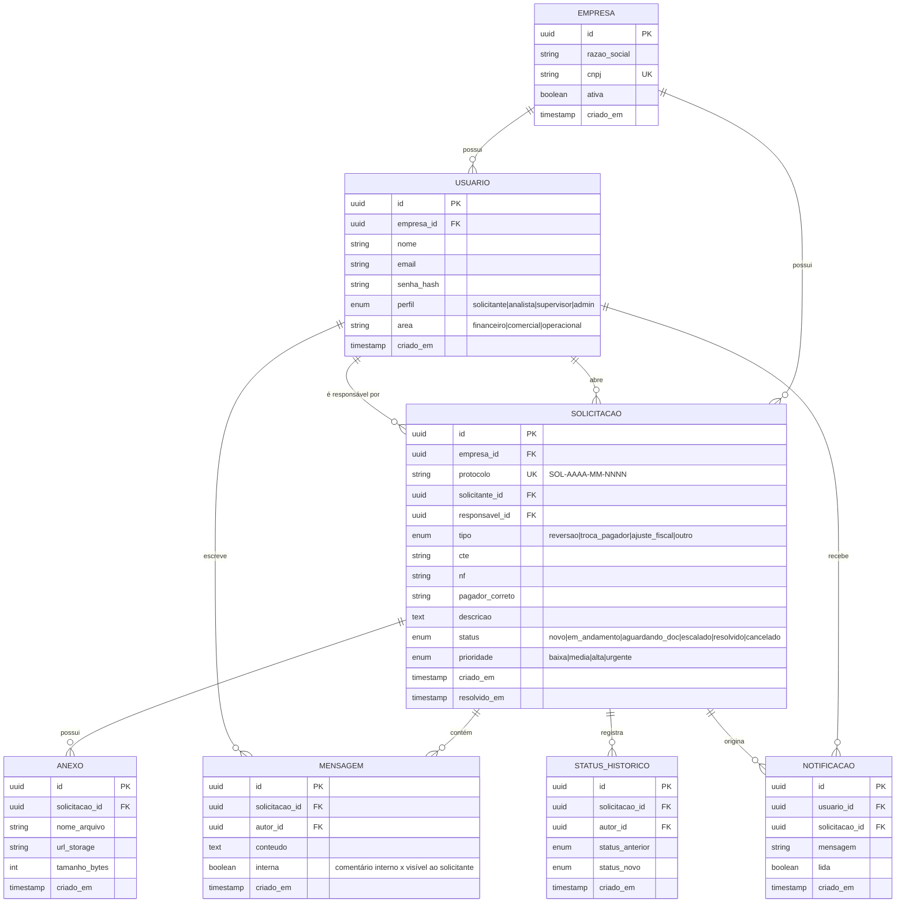

---

## 5.3 Principais Componentes

1. **API REST Backend** — lógica de negócio, validações, integrações
2. **Sistema de Autenticação** — login, recuperação de senha, múltiplos perfis
3. **Sistema de Notificações** — e-mails automáticos para cada ação
4. **Interface Web** — frontend moderno, responsivo, acessível
5. **Banco de Dados** — PostgreSQL, backups automáticos, replicação

---

## 5.4 Stack Tecnológica

| Camada | Tecnologia | Justificativa |
|--------|-----------|---------------|
| **Frontend** | React + Next.js | SPA responsiva com renderização híbrida (SSR/CSR); ecossistema maduro, grande comunidade e curva de aprendizado acessível para projeto individual. |
| **Backend** | Node.js + Express | Mesma linguagem (JavaScript/TypeScript) do frontend, reduzindo troca de contexto; excelente para APIs REST com alto volume de operações I/O, como é o caso de um sistema de tickets. |
| **Banco de Dados** | PostgreSQL | Banco relacional robusto e gratuito; os dados do SIGOF (solicitações, usuários, histórico) são fortemente estruturados e relacionais, com necessidade de integridade referencial e auditoria. |
| **Cache** | Redis | Acelera consultas frequentes (filas e dashboards) e reduz carga no banco; suporta o RNF02 (resposta < 2s). |
| **Storage de Anexos** | AWS S3 (ou MinIO em ambiente local) | Armazenamento de arquivos desacoplado do banco, escalável e de baixo custo; mantém o banco enxuto. |
| **Notificações** | SendGrid (SMTP) | Serviço gerenciado de e-mail com boa entregabilidade; evita configurar e manter servidor de e-mail próprio. |
| **Autenticação** | JWT | Autenticação stateless adequada para API REST; integra-se naturalmente com o controle de perfis (RBAC). |
| **Controle de versão** | Git + GitHub | Versionamento, histórico de evolução da RFC e repositório público exigido pela disciplina. |

> **Observação:** Para o MVP do TCC, serviços como S3, Redis e SendGrid podem ser substituídos por equivalentes locais/gratuitos (MinIO, cache em memória, Mailtrap) sem alterar a arquitetura.

---

## 5.5 Estratégia de Multi-tenancy (Evolução para SaaS)

Embora o MVP opere apenas para a Aceville, a arquitetura é preparada para que, no futuro, várias transportadoras usem o mesmo sistema sem enxergar os dados umas das outras (ver seção 1.7).

**Modelo adotado: tenant único por banco com isolamento lógico (*shared database, shared schema*).**

- Toda tabela de negócio (`Usuario`, `Solicitacao`, etc.) carrega uma coluna `empresa_id` que identifica o tenant.
- Toda consulta ao banco é **obrigatoriamente filtrada por `empresa_id`**, derivado do usuário autenticado (presente no token JWT) — nunca de um parâmetro enviado pelo cliente.
- Um *middleware* central injeta o filtro de empresa em todas as requisições, evitando que um desenvolvedor esqueça de aplicá-lo.

**Por que esse modelo:**

- É o de **menor custo e complexidade** para começar — adequado a um MVP e a transportadoras pequenas/médias.
- Permite evoluir depois para isolamento mais forte (schema por tenant ou banco por tenant) caso algum cliente exija, sem reescrever a aplicação.

**Cuidados de segurança associados (ver também seção 6):**

- O `empresa_id` nunca é aceito do frontend; é sempre resolvido no backend a partir da sessão.
- Anexos no storage são organizados por empresa (ex.: prefixo `empresa/{id}/...`) com acesso autenticado.
- Testes automatizados devem incluir cenários de *cross-tenant* (garantir que um usuário da empresa A jamais acesse dados da empresa B).

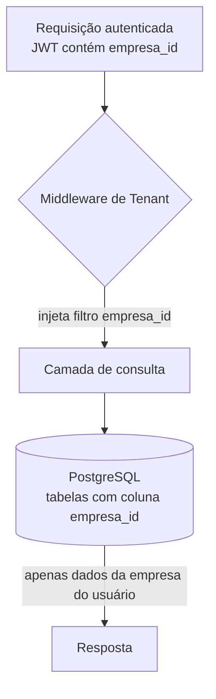

---

# 6. Segurança e Privacidade

O SIGOF lida com dados operacionais sensíveis (informações fiscais de CTe/NF, pagadores, dados de funcionários), o que exige cuidados de segurança desde o projeto.

## 6.1 Controles de Segurança (OWASP Top 10)

| Risco (OWASP) | Mitigação no SIGOF |
|---------------|--------------------|
| **Quebra de Controle de Acesso** | Autorização baseada em perfis (RBAC): solicitante, analista, supervisor e admin têm permissões distintas. Cada requisição valida o perfil no backend. **Isolamento multi-tenant:** todo acesso é filtrado por `empresa_id` derivado da sessão, impedindo acesso a dados de outra transportadora (ver seção 5.5). |
| **Falhas Criptográficas** | Senhas armazenadas com hash forte (bcrypt/argon2); tráfego sempre via HTTPS/TLS; dados sensíveis criptografados em repouso (RNF06). |
| **Injeção (SQL Injection)** | Uso de ORM/queries parametrizadas; validação e sanitização de todas as entradas. |
| **Design Inseguro** | Regras de negócio validadas no backend (nunca apenas no frontend); solicitações não podem ser excluídas, apenas finalizadas/canceladas (trilha de auditoria). |
| **Configuração Incorreta** | Variáveis de ambiente para segredos (sem credenciais no código); CORS restrito; cabeçalhos de segurança (Helmet). |
| **Componentes Vulneráveis** | Dependências monitoradas (npm audit / Dependabot); atualizações periódicas. |
| **Falhas de Autenticação** | Tokens JWT com expiração; bloqueio após tentativas falhas; política de senha forte. |
| **Falhas de Integridade** | Histórico imutável de status (`StatusHistorico`); logs de auditoria por no mínimo 12 meses (RNF09). |
| **Falhas de Log e Monitoramento** | Registro de todas as operações relevantes com timestamp e autor. |

## 6.2 Privacidade e LGPD

- **Dados coletados:** dados de identificação dos funcionários (nome, e-mail corporativo, perfil) e dados operacionais das solicitações (CTe, NF, pagador, descrições e anexos).
- **Finalidade:** uso exclusivamente interno para gestão e auditoria de ocorrências de frete; não há comercialização nem compartilhamento externo dos dados.
- **Base legal:** legítimo interesse da empresa na gestão de seus processos operacionais e cumprimento de obrigações fiscais.
- **Armazenamento:** dados em banco PostgreSQL com acesso restrito por perfil; anexos em storage com acesso autenticado; criptografia em repouso e em trânsito.
- **Retenção:** logs e histórico mantidos por no mínimo 12 meses para fins de auditoria.
- **Direitos do titular:** como o sistema é interno e corporativo, solicitações de correção ou remoção de dados pessoais de funcionários são tratadas pelo administrador, mediante registro. Solicitações operacionais não são excluídas (apenas canceladas) por exigência de auditoria fiscal.

---

# 7. Planejamento do Projeto

Cronograma estimado para o desenvolvimento ao longo do semestre, alinhado às entregas avaliativas da disciplina (NP1, NP2 e NP3).

| Marco | Descrição | Entregáveis | Prazo |
|-------|-----------|-------------|-------|
| **M1 — Fundamentação** | Definição do problema, objetivos, personas e benchmark. | RFC seções 1 e 2 (NP1) | Semanas 1–3 |
| **M2 — Estado da Arte e Requisitos** | Benchmark detalhado, requisitos funcionais/não funcionais e regras de negócio. | RFC seções 2 e 3 + benchmark (NP2) | Semanas 4–6 |
| **M3 — Modelagem e Design** | Diagramas C4, modelo de dados (DER), wireframes e fluxos de UX. | RFC seções 4 e 5 + mockups | Semanas 7–9 |
| **M4 — Prova de Conceito** | Setup do ambiente, autenticação e CRUD de solicitações. | Repositório com POC funcional | Semanas 10–12 |
| **M5 — MVP** | Fluxo completo: abertura, fila, atribuição, status e notificações. | MVP demonstrável | Semanas 13–15 |
| **M6 — Validação e Banca** | Coleta de feedback com a equipe da Aceville; apresentação da RFC a três professores; ajustes finais. | RFC final + evidências de extensão (NP3) | Semanas 16–18 |

---

# 8. Referências

- ATLASSIAN. *Jira Service Management*. Disponível em: https://www.atlassian.com/software/jira/service-management
- FRESHWORKS. *Freshdesk*. Disponível em: https://www.freshworks.com/freshdesk/
- ZENDESK. *Zendesk Service*. Disponível em: https://www.zendesk.com/
- BROWN, Simon. *The C4 model for visualising software architecture*. Disponível em: https://c4model.com/
- OWASP FOUNDATION. *OWASP Top 10*. Disponível em: https://owasp.org/www-project-top-ten/
- BRASIL. *Lei nº 13.709/2018 — Lei Geral de Proteção de Dados Pessoais (LGPD)*. Disponível em: https://www.planalto.gov.br/ccivil_03/_ato2015-2018/2018/lei/l13709.htm
- REACT. *Documentação oficial*. Disponível em: https://react.dev/
- NEXT.JS. *Documentação oficial*. Disponível em: https://nextjs.org/docs
- NODE.JS. *Documentação oficial*. Disponível em: https://nodejs.org/docs/
- POSTGRESQL. *Documentation*. Disponível em: https://www.postgresql.org/docs/
- CATÓLICA SC. *The Portfolio Playbook — PAC Extensionista VII*. Disponível em: https://github.com/CatolicaSC-Portfolio/The-Portfolio-Playbook

---

# 9. Apêndices

- **Apêndice A — Mockups:** prompts e telas geradas no Google Stitch (ver arquivo [`mockup.md`](../mockup.md) na raiz do repositório).
- **Apêndice B — Guia de imagens:** mapa de onde inserir cada print/diagrama nesta RFC (ver [`guia-de-imagens.md`](../guia-de-imagens.md)).
- **Apêndice C — Protótipo navegável:** _(inserir link do Figma/Stitch quando disponível)_
- **Apêndice D — Evidências de extensão:** _(inserir prints de conversas/feedback com a equipe da Aceville e formulário de validação)_
- **Apêndice E — Parecer da banca:** _(inserir os três pareceres dos professores após a apresentação)_

---

# 10. Parecer do Comitê de Avaliação

(A ser preenchido pelos professores)

**Avaliador 1:** __________________________  
**Status:** [ ] Aprovado  [ ] Ajustar

Observações:

---

**Avaliador 2:** __________________________  
**Status:** [ ] Aprovado  [ ] Ajustar

Observações:

---

**Avaliador 3:** __________________________  
**Status:** [ ] Aprovado  [ ] Ajustar

Observações:
